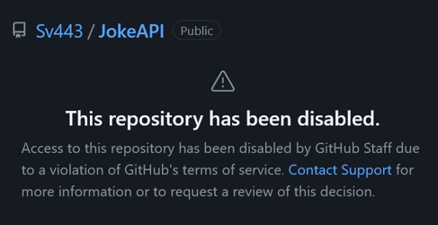

# Fuck.  
  

  

# Todo for v2.4.0:
- [ ] How to make GitHub unblock the repo:
    - [ ] Tell support to send me a screenshot of the Version 2.4.0 PR
        > So I can continue to work on it

    - [ ] Ask support to unblock the repo but set it to private so I can work on fixing the issues
        > I will probably need to store the joke files somewhere else.  
        > The difficult part will be to find a way to still be able to include them in version control.  
        > Maybe a subproject hosted on a different platform? Maybe a selfhosted GitLab instance or something? idk.

    - [ ] Exclude "Dark" from the "Any" category by default
        > This is not backwards compatible so I'm still unsure whether I'll do this.  
        > GitHub probably expects me to just not host dark jokes on their site, since it is potentially against their community guidelines.  
        > I don't know why they said "violation of terms of service" then, but without an answer from support I can only speculate.
